<!-- No borrar o modificar -->
[Inicio](./index.md)

## Sesión 11 


# Actividad: 
### Propiedades CSS, SeudoClases, SeudoElementos y Reglas @css

>Crear un documento HTML y probar cada uno de los ejemplos de la sesión 11:


## Propiedades CSS más comunes
Las propiedades CSS más comunes son las que se utilizan para controlar el aspecto de los elementos HTML. Estas propiedades incluyen:

### Tamaño y posición:
* width: establece el ancho de un elemento.
* height: establece la altura de un elemento.
* margin: establece el espacio entre un elemento y sus bordes.
* padding: establece el espacio entre el contenido de un elemento y sus bordes.
* float: establece la posición de un elemento en el flujo del documento.
* position: establece la posición absoluta o relativa de un elemento.
Ejemplo:

```css

body {
  width: 100%;
  height: 100vh;
  margin: 0;
  padding: 0;
}

h1 {
  width: 50%;
  height: 100px;
  margin: 10px auto;
  padding: 20px;
}

p {
  float: left;
  width: 50%;
  height: 100px;
  margin: 10px;
  padding: 20px;
}

```


Este código CSS establecerá el ancho y la altura del cuerpo del documento en 100% y 100vh, respectivamente. También establecerá el margen y el relleno del cuerpo del documento en 0. El encabezado tendrá un ancho de 50%, una altura de 100px, un margen de 10px a cada lado y un relleno de 20px en todos los lados. El párrafo tendrá un ancho de 50%, una altura de 100px, un margen de 10px en la parte superior e inferior y un relleno de 20px en todos los lados.

### Fuente:
* font-family: establece la familia de fuentes de un elemento.
* font-size: establece el tamaño de la fuente de un elemento.
* font-weight: establece el peso de la fuente de un elemento.
* font-style: establece el estilo de la fuente de un elemento.
* font-variant: establece la variante de la fuente de un elemento.

Ejemplo:

```css
body {
  font-family: sans-serif;
  font-size: 16px;
}

h1 {
  font-family: 'Times New Roman', serif;
  font-size: 24px;
  font-weight: bold;
}

p {
  font-style: italic;
  font-variant: small-caps;
}
```


Este código CSS establecerá la familia de fuentes del cuerpo del documento en sans-serif y el tamaño de la fuente en 16px. El encabezado tendrá la familia de fuentes en Times New Roman, serif, el tamaño de la fuente en 24px y el peso de la fuente en negrita. El párrafo tendrá el estilo de la fuente en cursiva y la variante de la fuente en mayúsculas pequeñas.

### Texto:
* text-align: establece la alineación del texto en un elemento.
* text-decoration: establece el subrayado, el tachado o el texto en línea.
* text-transform: establece la transformación del texto en un elemento.
* letter-spacing: establece el espaciado entre letras en un elemento.

```css
h1 {
  text-align: center;
}

p {
  text-align: justify;
}
```


Este código CSS mostrará el encabezado centrado y el párrafo justificado.

### Bordes:
* border-width: establece el ancho del borde de un elemento.
* border-style: establece el estilo del borde de un elemento.
* border-color: establece el color del borde de un elemento.
* border-radius: establece los bordes redondeados de un elemento.

Ejemplo:

```css
body {
  border: 1px solid black;
}

h1 {
  border-width: 2px;
  border-style: dashed;
  border-color: red;
}

p {
  border-radius: 10px;
}
```


Este código CSS establecerá un borde de 1px de ancho y color negro alrededor del cuerpo del documento. El encabezado tendrá un borde de 2px de ancho, estilo de línea discontinua y color rojo. El párrafo tendrá bordes redondeados de 10px.

### SeudoClases y SeudoElementos
>SeudoClases
En CSS, las pseudoclases son palabras clave que se añaden a los selectores para especificar un estado especial del elemento seleccionado. Por ejemplo, la pseudoclase :hover se utiliza para aplicar un estilo cuando el usuario pasa el cursor por encima de un elemento.

Las pseudoclases se pueden dividir en dos categorías principales:

* **Pseudoclases de estado**: Estas pseudoclases especifican el estado actual del elemento, como si está seleccionado, activo o en foco.
* **Pseudoclases de acción**: Estas pseudoclases especifican el estado del elemento en respuesta a una acción del usuario, como hacer clic o pasar el cursor por encima.

[https://developer.mozilla.org/en-US/docs/Web/CSS/:-moz-broken](https://developer.mozilla.org/en-US/docs/Web/CSS/:-moz-broken)

Orden de las pseudoclases:

El orden en el que se aplican las pseudoclases es importante. Las pseudoclases de estado se aplican primero, seguidas de las pseudoclases de acción.

Por ejemplo, el siguiente código cambiará el color de fondo de un enlace a rojo cuando el usuario lo visite y a verde cuando lo haga clic:

```css
a {
  color: blue;
}

a:link {
  background-color: red;
}

a:active {
  background-color: green;
}
```
Este código se traducirá en el siguiente HTML:

```html
<a href="">Repositorio de evidencias</a>
```

>aqui se evidencia el cambio al hacer click con el cursor


Cuando el usuario visite el enlace por primera vez, tendrá un fondo rojo. Cuando el usuario haga clic en el enlace, tendrá un fondo verde.

Otros ejemplos:

* Cambiar el color de fondo de un párrafo cuando el usuario pasa el cursor por encima:

```css
p {
  background-color: white;
}

p:hover {
  background-color: gray;
}
```

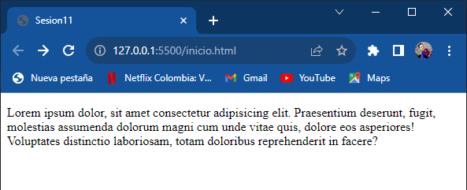

>aqui se evidencia el cambio al poner el cursor encima


* Activar un botón cuando el usuario hace clic en él:

```css
button {
  cursor: pointer;
  background-color: blue;
}

button:active {
  background-color: red;
}
```


>aqui se ve el cambio al hacer click


* Deshabilitar un botón:
>yo use este html
```html
<button name="button" >Click me</button>
    <button name="button" disabled>Click me</button>
```

```css
button {
  cursor: pointer;
  background-color: blue;
}

button:disabled {
  cursor: not-allowed;
  background-color: gray;
}
```
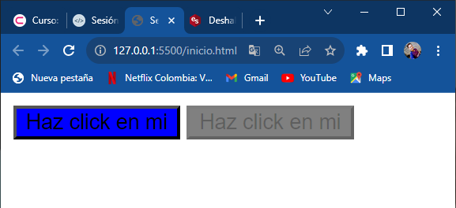

* Activar un enlace cuando el usuario hace clic en él:

```css
a {
  color: blue;
}

a:link {
  background-color: red;
}

a:active {
  background-color: green;
}
```

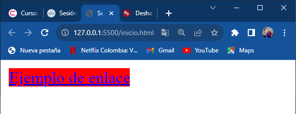

>cuando esta activo

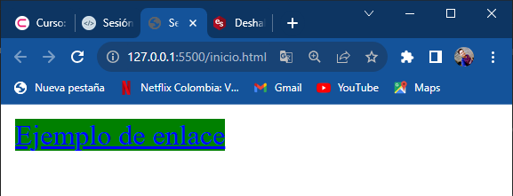

* Cambiar el color de fondo de una lista cuando el usuario hace clic en el elemento:

```css
ul {
  list-style-type: none;
  background-color: white;
}

li:nth-of-type(1):hover {
  background-color: red;
}

li:nth-of-type(2):hover {
  background-color: green;
}

li:nth-of-type(3):hover {
  background-color: blue;
}
```
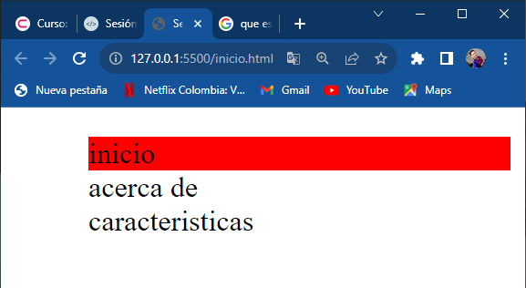


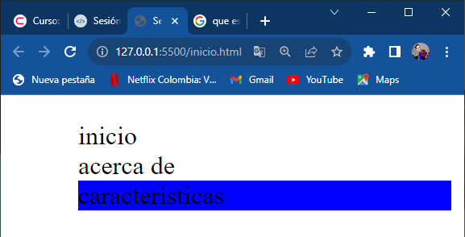

## SeudoElementos
Los pseudoelementos son una característica de CSS que permite seleccionar y dar estilo a elementos que no existen en el HTML, o que no son un simple elemento en sí. Por ejemplo, podemos utilizar un pseudoelemento para añadir una flecha al final de un párrafo, o para crear un efecto de sombra debajo de un elemento.

Los pseudoelementos se añaden a los selectores, pero en lugar de describir un estado especial, permiten añadir estilos a una parte concreta del documento. Por ejemplo, el pseudoelemento ::first-line selecciona solo la primera línea del elemento especificado por el selector.

Los pseudoelementos son palabras clave que se añaden a los selectores para seleccionar y dar estilo a elementos que no existen en el HTML, o que no son un simple elemento en sí.

[https://developer.mozilla.org/en-US/docs/Web/CSS/::-moz-color-swatch](https://developer.mozilla.org/en-US/docs/Web/CSS/::-moz-color-swatch)

**Pseudoelementos de contenido:**

Ejemplos de pseudoelementos de contenido:

* Establece la primera línea de todos los párrafos (p) en negrita y roja:

```css
p::first-line {
  font-weight: bold;
  color: red;
}
```
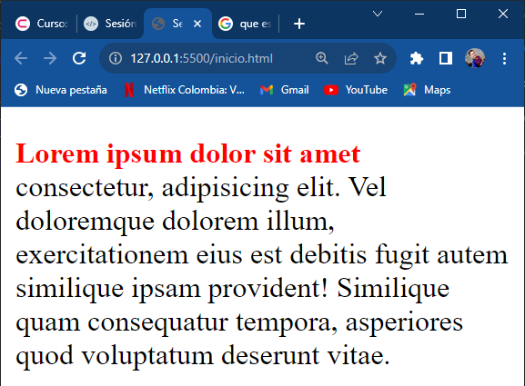

* La primera letra estará en negrita, en color crimson y un tamaño de 60 píxeles

```css
p::first-letter {
    font-weight: bold;
    color: crimson;
    font-size: 60px;
}
```
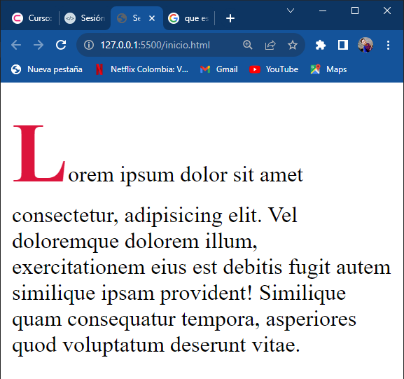

* Añadir una flecha al final de un párrafo:

```css
p {
  font-size: 16px;
  line-height: 2;
}

p::after {
  content: "→";
  font-size: 20px;
  position: absolute;
  bottom: 0;
  right: 0;
}
```
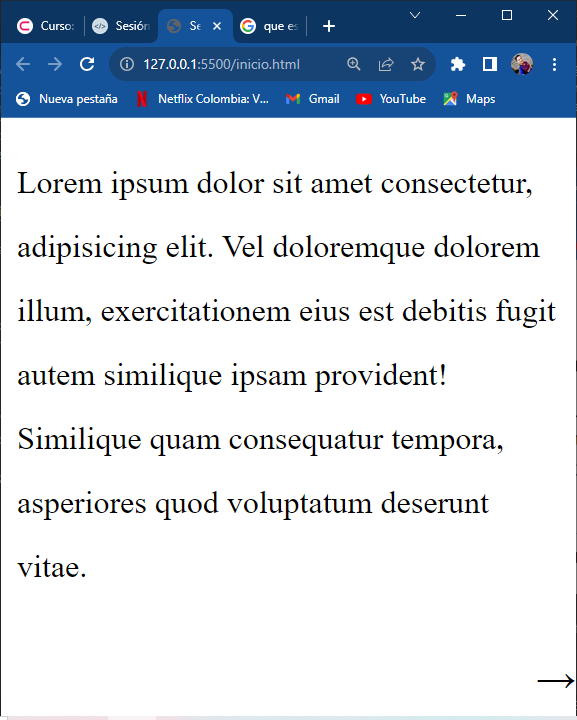

**Pseudoelementos de posición:**

Ejemplos de pseudoelementos de posición:

`::selection`

Cambiar el color de fondo del texto seleccionado:

```css
body {
  color: black;
  background-color: white;
}

::selection {
  background-color: red;
}
```
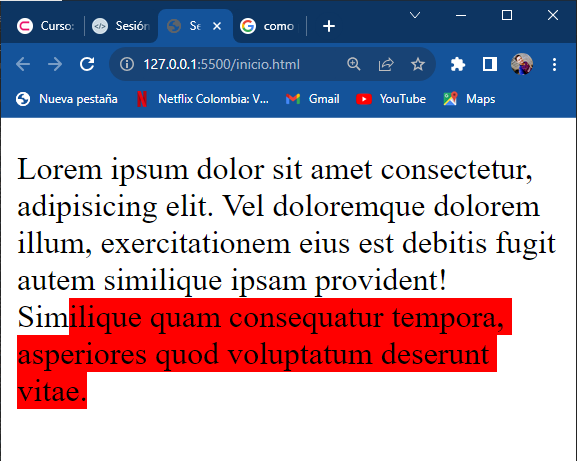

`::before-after:`

* Añadir contenido antes y después del elemento.

```css
h1::before {
    content: url("https://icons.iconarchive.com/icons/gartoon-team/gartoon-action/48/dialog-apply-icon.png");
}
```
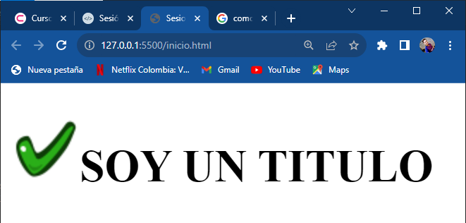

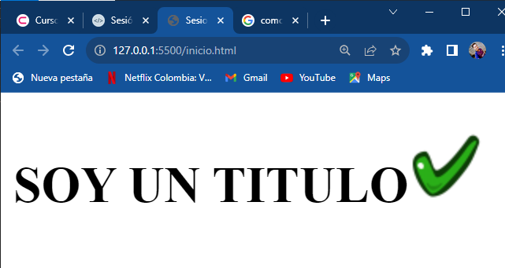

[Sesión 10](https://xeduark.github.io/Evidencias_introduccion_a_la_programacion/sesion10.html)

[Sesión 12](https://xeduark.github.io/Evidencias_introduccion_a_la_programacion/sesion12.html)