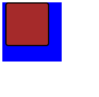

<!-- No borrar o modificar -->
[Inicio](./index.md)

## Sesión 9 


# Actividad: 
>Propiedades de espaciado y unidades de medida
Objetivo:

Practicar el uso de las propiedades de espaciado margin, padding, border y border-radius, con diferentes unidades de medida.

1. Crea un nuevo archivo HTML y CSS.
2. En el archivo HTML, agrega el siguiente código:

```html
<!DOCTYPE html>
<html lang="es">
<head>
  <meta charset="UTF-8">
  <title>Propiedades de espaciado</title>
  <link rel="stylesheet" href="style.css">
</head>
<body>
  <div class="contenedor">
    <div class="elemento"></div>
  </div>
</body>
</html>
```

3. En el archivo CSS, agrega el siguiente código:

```css
.contenedor {
  width: 200px;
  height: 200px;
}

.elemento {
  width: 100px;
  height: 100px;
}
```
4. Abre el archivo HTML en tu navegador. Verás un cuadrado de 100x100 píxeles.

5. Practicar el uso de las propiedades de espaciado.

* **Margin:** Agrega un margen de 10 píxeles a todos los lados del elemento.

```css
.elemento {
  margin: 10px;
  width: 100px;
  height: 100px;
}
```
* **Padding:** Agrega un relleno de 20 píxeles a todos los lados del elemento.

```css
.elemento {
  padding: 20px;
  margin: 10px;
  width: 100px;
  height: 100px;
}
```

* **Border:** Agrega un borde de 5 píxeles de color rojo.

```css
.elemento {
  border: 5px solid red;
  padding: 20px;
  margin: 10px;
  width: 100px;
  height: 100px;
}
```
* **Border-radius:** Agrega un radio de esquina de 10 píxeles.

```css
.elemento {
  border-radius: 10px;
  border: 5px solid red;
  padding: 20px;
  margin: 10px;
  width: 100px;
  height: 100px;
}
```
* **Unidades de medida:** Prueba diferentes unidades de medida para las propiedades de espaciado. Por ejemplo, puedes usar unidades porcentuales (%) para establecer un margen o relleno del 50%.

```css
.elemento {
  border-radius: 10px;
  border: 5px solid red;
  margin: 50%;
  padding: 50%;
  width: 100px;
  height: 100px;
}
```
### Preguntas:

1. ¿Qué es la propiedad margin?
2. ¿Qué es la propiedad padding?
3. ¿Qué es la propiedad border?
4. ¿Qué es la propiedad border-radius?
5. ¿Qué unidades de medida se pueden utilizar para las propiedades de espaciado?

### SOLUCIÓN

>Html

```html
<!DOCTYPE html>
<html lang="es">
<head>
  <meta charset="UTF-8">
  <title>Propiedades de espaciado</title>
  <link rel="stylesheet" href="diseño.css">
</head>
<body>
  <div class="contenedor">
    <div class="elemento"></div>
  </div>
</body>
</html>
```
>CSS

```css
.contenedor {
    width: 200px;
    height: 200px;
  background-color:  blue;

  }
  
  .elemento {
    border-radius: 10px;
    border: 5px solid rgb(0, 0, 0);
    padding: 20px;
    margin: 10px ;
    width: 100px;
    height: 100px;
    background-color: brown;
    
  }
```


1. La propiedad **margin**  establece el margen para los cuatro lados. Es una abreviación para evitar tener que establecer cada lado por separado con las otras propiedades de margen: margin-top (en-US), margin-right , margin-bottom y margin-left (en-US).

2. La propiedad **padding** es la que crea el espacio o área alrededor del contenido de un elemento. Consiste en el relleno superior, derecho, inferior e izquierdo. En CSS se escriben como padding-top:, padding-right:, padding-bottom: y padding-left:.

3. La propiedad **border** permite definir en una única regla todos los bordes de los elementos seleccionados. Se puede utilizar border para definir el o los valores siguientes: border-width , border-style , border-color.

4. La propiedad CSS **border-top-left-radius** establece el redondeo de la esquina superior izquierda del elemento. El redondeo puede ser un círculo o una elipse, o si uno de los valores es 0 , no se redondeará la esquina, dejándola cuadrada.

5. ### Unidades de medida
Las medidas en CSS se emplean, entre otras, para definir la altura, anchura y márgenes de los elementos y para establecer el tamaño de letra del texto. Todas las medidas se indican como un valor numérico entero o decimal seguido de una unidad de medida (sin ningún espacio en blanco entre el número y la unidad de medida).

CSS divide las unidades de medida en dos grupos: absolutas y relativas. Las medidas relativas definen su valor en relación con otra medida, por lo que para obtener su valor real, se debe realizar alguna operación con el valor indicado. Las unidades absolutas establecen de forma completa el valor de una medida, por lo que su valor real es directamente el valor indicado.

Si el valor es 0, la unidad de medida es opcional. Si el valor es distinto a 0 y no se indica ninguna unidad, la medida se ignora completamente, lo que suele ser uno de los errores más habituales de los diseñadores que empiezan con CSS. Algunas propiedades permiten indicar medidas negativas, aunque habitualmente sus valores son positivos. Si el valor decimal de una medida es inferior a 1, se puede omitir el 0 de la izquierda (0.5em es equivalente a .5em).

### Unidades absolutas
Una medida indicada mediante unidades absolutas está completamente definida, ya que su valor no depende de otro valor de referencia. A continuación se muestra la lista completa de unidades absolutas definidas por CSS y su significado:

* in, pulgadas ("inches", en inglés). Una pulgada equivale a 2.54 centímetros.
* cm, centímetros.
* mm, milímetros.
* pt, puntos. Un punto equivale a 1 pulgada/72, es decir, unos 0.35 milímetros.
* pc, picas. Una pica equivale a 12 puntos, es decir, unos 4.23 milímetros.
A continuación se muestran ejemplos de utilización de unidades absolutas:

```css
/* El cuerpo de la página debe mostrar un margen de media pulgada */
body { margin: 0.5in; }

/* Los elementos <h1> deben mostrar un interlineado de 2 centímetros */
h1 { line-height: 2cm; }

/* Las palabras de todos los párrafos deben estar separadas 4 milímetros entre si */
p { word-spacing: 4mm; }

/* Los enlaces se deben mostrar con un tamaño de letra de 12 puntos */
a { font-size: 12pt }

/* Los elementos <span> deben tener un tamaño de letra de 1 pica */
span { font-size: 1pc }
```
La principal ventaja de las unidades absolutas es que su valor es directamente el valor que se debe utilizar, sin necesidad de realizar cálculos intermedios. Su principal desventaja es que son muy poco flexibles y no se adaptan fácilmente a los diferentes medios.

De todas las unidades absolutas, la única que suele utilizarse es el punto (pt). Se trata de la unidad de medida preferida para establecer el tamaño del texto en los documentos que se van a imprimir, es decir, para el medio print de CSS, tal y como se verá más adelante.

### Unidades relativas
La unidades relativas, a diferencia de las absolutas, no están completamente definidas, ya que su valor siempre está referenciado respecto a otro valor. A pesar de su aparente dificultad, son las más utilizadas en el diseño web por la flexibilidad con la que se adaptan a los diferentes medios.

A continuación se muestran las tres unidades de medida relativas definidas por CSS y la referencia que toma cada una para determinar su valor real:

* em, (no confundir con la etiqueta `<em>` de HTML) relativa respecto del tamaño de letra del elemento.
* ex, relativa respecto de la altura de la letra x ("equis minúscula") del tipo y tamaño de letra del elemento.
* px, (píxel) relativa respecto de la resolución de la pantalla del dispositivo en el que se visualiza la página HTML.

Las unidades em y ex no han sido creadas por CSS, sino que llevan décadas utilizándose en el campo de la tipografía. Aunque no es una definición exacta, la unidad 1em equivale a la anchura de la letra M ("eme mayúscula") del tipo y tamaño de letra del elemento.

La unidad em hace referencia al tamaño en puntos de la letra que se está utilizando. Si se utiliza una tipografía de 12 puntos, 1em equivale a 12 puntos. El valor de 1ex se puede aproximar por 0.5 em.

Si se considera el siguiente ejemplo:

`p { margin: 1em; }`

La regla CSS anterior indica que los párrafos deben mostrar un margen de anchura igual a 1em. Como se trata de una unidad de medida relativa, es necesario realizar un cálculo matemático para determinar la anchura real de ese margen.

La unidad de medida em siempre hace referencia al tamaño de letra del elemento. Por otra parte, todos los navegadores muestran por defecto el texto de los párrafos con un tamaño de letra de 16 píxel. Por tanto, en este caso el margen de 1em equivale a un margen de anchura 16px.


A continuación se modifica el ejemplo anterior para cambiar el tamaño de letra de los párrafos:

`p { font-size: 32px; margin: 1em; }`

El valor del margen sigue siendo el mismo en unidades relativas (1em) pero su valor real ha variado porque el tamaño de letra de los párrafos ha variado. En este caso, el margen tendrá una anchura de 32px, ya que 1em siempre equivale al tamaño de letra del elemento.

Si se quiere reducir la anchura del margen a 16px pero manteniendo el tamaño de letra de los párrafos en 32px, se debe utilizar la siguiente regla CSS:

`p { font-size: 32px; margin: 0.5em; }`

El valor 0.5em se interpreta como "la mitad del tamaño de letra del elemento", ya que se debe multiplicar por 0.5 su tamaño de letra (32px x 0.5 = 16px). De la misma forma, si se quiere mostrar un margen de 8px de anchura, se debería utilizar el valor 0.25em, ya que 32px x 0.25 = 8px.

La gran ventaja de las unidades relativas es que siempre mantienen las proporciones del diseño de la página. Establecer el margen de un elemento con el valor 1em equivale a indicar que *"el margen del elemento debe ser del mismo tamaño que su letra y debe cambiar proporcionalmente"*.

En efecto, si el tamaño de letra de un elemento aumenta hasta un valor enorme, su margen de 1em también será enorme. Si su tamaño de letra se reduce hasta un valor diminuto, el margen de 1em también será diminuto. El uso de unidades relativas permite mantener las proporciones del diseño cuando se modifica el tamaño de letra de la página.

El funcionamiento de la unidad ex es idéntico a em, salvo que en este caso, la referencia es la altura de la letra x minúscula, por lo que su valor es aproximadamente la mitad que el de la unidad em.

Por último, las medidas indicadas en píxel también se consideran relativas, ya que el aspecto de los elementos dependerá de la resolución del dispositivo en el que se visualiza la página HTML. Si un elemento tiene una anchura de 400px, ocupará la mitad de una pantalla con una resolución de 800x600, pero ocupará menos de la tercera parte en una pantalla con resolución de 1440x900.

Las unidades de medida se pueden mezclar en los diferentes elementos de una misma página, como en el siguiente ejemplo:

`body { font-size: 10px; }`

`h1 { font-size: 2.5em; }`

En primer lugar, se establece un tamaño de letra base de 10 píxel para toda la página. A continuación, se asigna un tamaño de 2.5em al elemento `<h1>`, por lo que su tamaño de letra real será de 2.5 x 10px = 25px.

Como se vio en los capítulos anteriores, el valor de la mayoría de propiedades CSS se hereda de padres a hijos. Así por ejemplo, si se establece el tamaño de letra al elemento `<body>`, todos los elementos de la página tendrán el mismo tamaño de letra, salvo que indiquen otro valor.

Sin embargo, el valor de las medidas relativas no se hereda directamente, sino que se hereda su valor real una vez calculado. El siguiente ejemplo muestra este comportamiento:

```css
body {
  font-size: 12px;
  text-indent: 3em;
}
h1 { font-size: 15px }
```
La propiedad `text-indent`, como se verá en los próximos capítulos, se utiliza para tabular la primera línea de un texto. El elemento `<body>` define un valor para esta propiedad, pero el elemento `<h1>` no lo hace, por lo que heredará el valor de su elemento padre. Sin embargo, el valor heredado no es 3em, sino 36px.

Si se heredara el valor 3em, al multiplicarlo por el valor de font-size del elemento `<h1>` (que vale 15px) el resultado sería 3em x 15px = 45px. No obstante, como se ha comentado, los valores que se heredan no son los relativos, sino los valores ya calculados.

Por lo tanto, en primer lugar se calcula el valor real de 3em para el elemento `<body>`: 3em x 12px = 36px. Una vez calculado el valor real, este es el valor que se hereda para el resto de elementos.

### Porcentajes

El porcentaje también es una unidad de medida relativa, aunque por su importancia CSS la trata de forma separada a em, ex y px. Un porcentaje está formado por un valor numérico seguido del símbolo % y siempre está referenciado a otra medida. Cada una de las propiedades de CSS que permiten indicar como valor un porcentaje, define el valor al que hace referencia ese porcentaje.

Los porcentajes se pueden utilizar por ejemplo para establecer el valor del tamaño de letra de los elementos:
```css
body { font-size: 1em; }
h1 { font-size: 200%; }
h2 { font-size: 150%; }
```
Los tamaños establecidos para los elementos `<h1>` y `<h2>` mediante las reglas anteriores, son equivalentes a 2em y 1.5em respectivamente, por lo que es más habitual definirlos mediante em.

Los porcentajes también se utilizan para establecer la anchura de los elementos:
```css
div#contenido { width: 600px; }
div.principal { width: 80%; }
```
```html
<div id="contenido">
  <div class="principal">
    ...
  </div>
</div>
```
En el ejemplo anterior, la referencia del valor 80% es la anchura de su elemento padre. Por tanto, el elemento `<div>` cuyo atributo class vale principal tiene una anchura de 80% x 600px = 480px.

### Recomendaciones
En general, se recomienda el uso de unidades relativas siempre que sea posible, ya que mejora la accesibilidad de la página y permite que los documentos se adapten fácilmente a cualquier medio y dispositivo.


[Sesión 8](https://xeduark.github.io/Evidencias_introduccion_a_la_programacion/sesion8.html)


[Sesión 10](https://xeduark.github.io/Evidencias_introduccion_a_la_programacion/sesion10.html)


